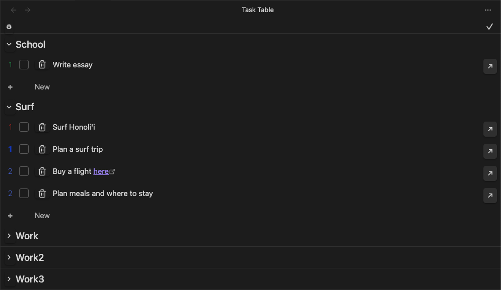

# Obsidian Task Table

A lightweight task-aggregation view for Obsidian. This plugin collects tasks from notes that match user-defined regex rules and displays them in a clean, flat table while retaining each task’s position in the hierarchy through numbering. Task Table is designed for users who maintain structured notes (e.g., Planner folders, project files, grouped outlines) and want a unified task view without losing context.

## Usage
Click the convenient ribbon icon to open the view. This will open the main table to show bullet points. The table preserves hierarchy by using numeric prefixes to indicate the depth of the task. The numbers can be dragged to rearrange the table and clicked to expand/contract the task. The checkbox is simple there for marking tasks as complete. The trash icon can be used to delete tasks. Tasks are directly editable in the table which automatically updates the corresponding note.

The settings page allows the user to define the regex rules for the notes to be auto-scanned to include in the table. They can be defined like this:  `.*/Planner/.*\\.md$`, which will match all notes in the `Planner` folder. Each note file will become its own list (with the file name as the header), and an optional grouping for all files that match that regex rule (mulitple rules can be defined). This allows for either one or two levels of headings.



## Installation

### Via Community Plugin
1. [Download](https://obsidian.md/download) and install Obsidian
2. Go to: Settings > Community Plugins > Browse
3. Search for and enable `Task Table`

### Manually
1. Create an obsidian vault folder and navigate into the plugin folder
2. Clone the Tasks Table GitHub repository into an obsidian vault plugin folder:
```bash
git clone https://github.com/cankanoa/obsidian-task-table.git
```
3. Make sure your NodeJS is at least v16: `node --version`
4. `npm i` or `yarn` to install dependencies
5. `npm run dev` to start compilation in watch mode
6. Reload Obsidian (View > Force Reload) to see changes

## Todo
- [ ] Add a slider (or dots) for auto-expanding all rows in the table view
- [ ] Add other columns for metadata
- [ ] Filter by tags
- [ ] New bullet when click return at the end of the task
- [ ] More efficient auto update task rows
- [ ] Headers still show up if there are no tasks in the file
- [ ] Select with type of bullets to include in settings

## Releasing new releases

- Update your `manifest.json` with your new version number, such as `1.0.1`, and the minimum Obsidian version required for your latest release.
- Update your `versions.json` file with `"new-plugin-version": "minimum-obsidian-version"` so older versions of Obsidian can download an older version of your plugin that's compatible.
- Create new GitHub release using your new version number as the "Tag version". Use the exact version number, don't include a prefix `v`. See here for an example: https://github.com/obsidianmd/obsidian-sample-plugin/releases
- Upload the files `manifest.json`, `main.js`, `styles.css` as binary attachments. Note: The manifest.json file must be in two places, first the root path of your repository and also in the release.
- Publish the release.

> You can simplify the version bump process by running `npm version patch`, `npm version minor` or `npm version major` after updating `minAppVersion` manually in `manifest.json`.
> The command will bump version in `manifest.json` and `package.json`, and add the entry for the new version to `versions.json`

## Code Formatting With eslint
- [ESLint](https://eslint.org/) is a tool that analyzes your code to quickly find problems. You can run ESLint against your plugin to find common bugs and ways to improve your code. 
- To use eslint with this project, make sure to install eslint from terminal:
  - `npm install -g eslint`
- To use eslint to analyze this project use this command:
  - `eslint main.ts`
  - eslint will then create a report with suggestions for code improvement by file and line number.
- If your source code is in a folder, such as `src`, you can use eslint with this command to analyze all files in that folder:
  - `eslint .\src\`

## Credit
This plugin was created by [Kanoa Lindiwe](https://kanoalindiwe.com) and is owned by Kanoa Lindiwe LLC.
